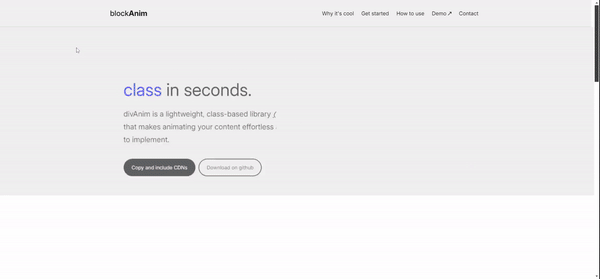

# blockAnim
blockAnim - Dumb, lightweight &amp; class based css animations for your website.
# blockAnim

**blockAnim** is a minimalist library designed to add elegant block animations to your website. With just 1kb of vanilla JS and 5kb of CSS, it brings your divs, images, and other elements to life in seconds.

## Features

- **Lightweight**: Only 1kb of JavaScript and 5kb of CSS.
- **Ease of Use**: Animate your blocks with simple class names.
- **Ready-to-Use**: Over 35 modern and fluid block animations.
- **Customization**: Easily add animation delays and repeats.

## How to Use

### Option 1: Use a CDN (Recommended)

This is the easiest way to get started with `textAnim.js`. Simply copy and paste the required lines into your HTML file, add your first class to anu html element, and watch the magic happen!

`<link rel="stylesheet" href="https://cdn.jsdelivr.net/gh/gc-guillaume/blockanim/animations.min.css">`

``

### Option 2: Download and Customize

If you'd like to tinker with the source code or create your own CSS animations, download the library as a zip file. Inside, you'll find the source code and a demo file to help you get started.

## Available Animations

Here’s a quick reference for the available animations and how to use them:

| **Class**                                    | **Requirement** | **Description**                                                                 | **Example**                                 | **Code**                                    |
|----------------------------------------------|-----------------|---------------------------------------------------------------------------------|---------------------------------------------|---------------------------------------------|
| `blockanim-{animation}`                      | Required        | Triggers the animation on scroll. Choose from over 35 animations available. [Check the demo](https://blockanim.guillaumecoulin.com/blockanim_demo.html).     | `blockanim-slide-up`                        | `

`    |
| `blockanim-{animation}-{delay in ms}`        | Optional        | Adds a delay to the animation in milliseconds, useful for sequential animations. | `blockanim-slide-up-400`                    | `

`|
| `blockanim-{animation}-{repeat}`             | Optional        | Repeats the animation each time the element is visible in the viewport.         | `blockanim-slide-up-400-repeat`             | `

`|

## License

This project is licensed under the MIT License. Feel free to use it in your commercial projects!
